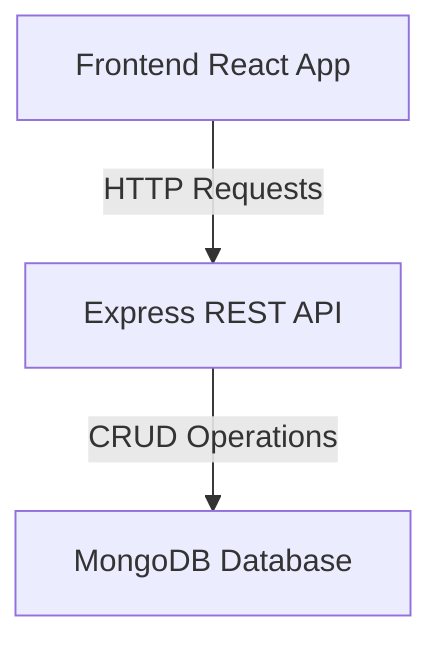

# Snapdeal Fullstack App

## Introduction

Snapdeal Fullstack App is a robust, full-stack eCommerce platform inspired by Snapdeal. It provides a seamless shopping experience for users, a comprehensive dashboard for sellers, and a powerful management interface for administrators. This project replicates core e-commerce workflows, from dynamic product discovery to secure checkout. Live Demo: https://snapdeal-fullstack-app.vercel.app/

## Features

- 💳 **Checkout and payments**
  - Dual payment modes with Razorpay online payments and Cash on Delivery.
  - Razorpay integration dynamically loads the checkout script for smooth payments.
  - Secure transactions with backend Razorpay order creation before opening the payment modal.
  - Branded checkout that shows the Razorpay logo inside the order summary.

- 👤 **User module**
  - Authentication using secure registration, JWT, and password hashing.
  - Product discovery with advanced filtering, sorting, and search capabilities.
  - Shopping cart with persistent add, update, and remove item support.
  - Order history view and real-time tracking for active shipments.

- 🏢 **Seller and admin modules**
  - Product management dashboard for sellers to add, edit, and delete listings.
  - Inventory tracking with real-time stock and sales performance monitoring.
  - Admin oversight tools to manage users, monitor total sales, and organize categories.

## Requirements

This project uses a modern JavaScript stack and depends on several tools and services. Ensure the following prerequisites and technologies are available before setup.

- Node.js and npm installed locally
- MongoDB instance or cluster
- Razorpay test account and API keys
- Frontend: React JS, Vite, Bootstrap, Styled Components
- Backend: Node.js with Express JS
- Database: MongoDB using Mongoose ODM
- Payments: Razorpay API test integration
- Deployment: Vercel for frontend and Render for backend

## Installation

Follow these steps to run the Snapdeal Fullstack App locally. Use separate terminals for server and client during development.

1. **Clone the repository**
   ```bash
   git clone https://github.com/SAIDINESH2001/snapdeal-fullstack-app.git
   cd snapdeal-fullstack-app
   ```

2. **Backend setup**
   ```bash
   cd server
   npm install
   # Create your .env file in the /server directory
   npm start
   ```

3. **Frontend setup**
   ```bash
   cd client
   npm install
   npm run dev
   ```

## Contributing

We welcome contributions! To contribute, work on a feature branch and ensure your changes remain focused and well-tested.

- Fork the repository and create your branch from `main`.
- Make your changes with clear, descriptive commit messages.
- Ensure code passes all linting and tests.
- Submit a pull request with a description of your changes.

### Contribution Guidelines

- Follow consistent code style and formatting.
- Update documentation as needed.
- Write tests for new features.

Contributions are welcome, and you can start by working in your own fork. Follow these simple steps to propose changes.

- Fork the project.
- Create your feature branch using `git checkout -b feature/AmazingFeature`.
- Commit your changes using `git commit -m 'Add some AmazingFeature'`.
- Push to the branch using `git push origin feature/AmazingFeature`.
- Open a pull request with a clear summary.

## Configuration

Configuration uses environment variables defined in `.env` files at different levels. Set these variables correctly to enable database access, authentication, and Razorpay payments.

- **Backend (`server/.env`):**
  - `PORT`: Backend server port.
  - `MONGODB_URI`: MongoDB connection string.
  - `JWT_SECRET`: Secret key for JWT signing.
  - `RAZORPAY_KEY_ID`: Razorpay test key identifier.
  - `RAZORPAY_KEY_SECRET`: Razorpay test key secret.

- **Frontend (`client/.env`):**
  - `VITE_API_URL`: URL of the backend API server.

Example backend environment configuration for payments and database:

```bash
PORT=5000
MONGODB_URI=your_mongodb_connection_string
JWT_SECRET=your_secret_key

# Razorpay Credentials Test Mode
RAZORPAY_KEY_ID=your_razorpay_key_id
RAZORPAY_KEY_SECRET=your_razorpay_key_secret
```

### Folder Structure

The project follows a clear client-server architecture with a modular layout. Use this structure as a guide when navigating or extending the codebase.

```plaintext
snapdeal-fullstack-app/
├── client/                # Frontend React application
│   ├── public/            # Static assets (favicons, etc.)
│   └── src/
│       ├── assets/        # Images, icons, and fonts
│       ├── components/    # Reusable UI (common, layout, product, cart, etc.)
│       ├── pages/         # View components (Home, Products, Admin, etc.)
│       ├── context/       # React Context API providers
│       ├── services/      # API call logic (including Razorpay integration)
│       ├── hooks/         # Custom React hooks
│       ├── utils/         # Helper functions
│       └── styles/        # Global CSS/Styling
├── server/                # Backend Node.js application
│   ├── src/
│   │   ├── config/        # Database and environment configurations
│   │   ├── models/        # MongoDB schemas (userSchema.js, etc.)
│   │   ├── controllers/   # Request handling (userControllers.js, etc.)
│   │   ├── routes/        # API endpoints (userRoutes.js, etc.)
│   │   ├── middlewares/   # Auth and error handling
│   │   ├── services/      # Business logic (authService.js, etc.)
│   │   ├── utils/         # Utilities (hashPassword.js, etc.)
│   │   └── validations/   # Request body validation logic
│   └── server.js          # Entry point for backend
├── .env                   # Environment variables (root)
└── README.md              # Project documentation
```

## Usage

Once the application is running, users and admins can access different workflows. Use the live demo or local environment to explore all flows.

- Register and log in as a user to manage your profile and cart.
- Browse products, apply filters or search, and add items to your cart.
- Proceed to checkout using Razorpay online payments or Cash on Delivery.
- View past orders, track active orders, and manage listings or users if you are a seller or admin.

## System Architecture

This application follows a client-server architecture with clear separation of concerns. The frontend is a component-based SPA, and the backend exposes a RESTful MVC-style API secured by middleware.



## License

This project is provided for educational purposes. Refer to the repository for license details. 

For more details, issues, or feature requests, please visit the [GitHub repository](https://github.com/SAIDINESH2001/snapdeal-fullstack-app).
